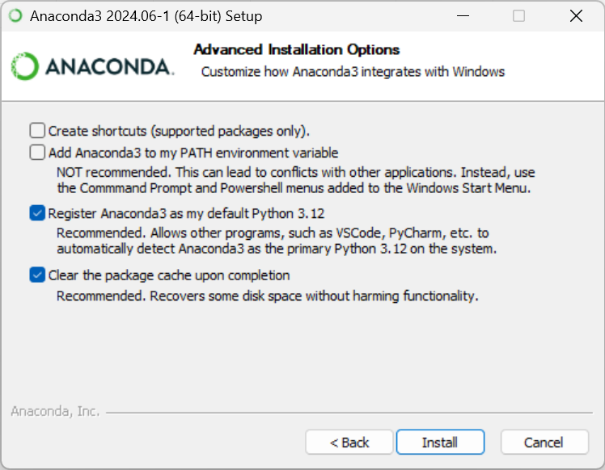
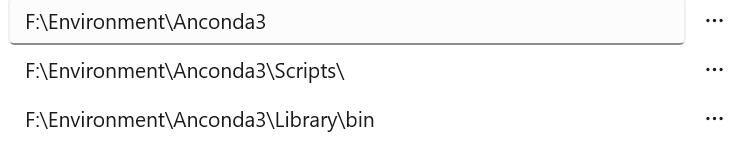
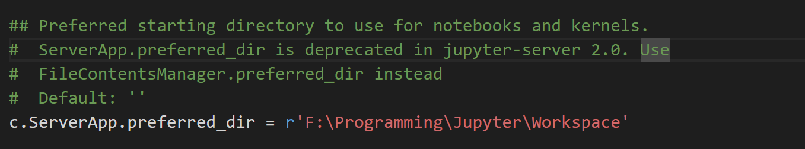

# 暑期AI实践营总结
## 一、Anconda 环境配置与 Python 入门

### 前言：为什么会选择 Anconda ？

Anaconda 是一个免费、易于安装的包管理器、环境管理器和 Python 发行版，它提供了一站式安装包，包含了大量常用的库（如 NumPy、Pandas、Matplotlib、SciPy 等），一次安装即可使用，而且使用 `conda` 管理包和虚拟环境，能够自动解决依赖关系，避免包之间的冲突。

直接安装 Python，需要手动安装和配置每个库，这个过程可能繁琐且容易出错，使用 `pip` 安装包时，依赖管理不如 `conda` 方便，容易出现包冲突问题。需要手动使用 `venv` 创建虚拟环境，配置复杂度较高。

### 1. 安装 Anconda

完整版 Anconda 的体积十分巨大，包含上千个包，如果觉得完整安装十分占内存可以选择 Miniconda ，两者并没有很大区别，只不过后者安装完需要的包需要自行安装。

考虑到未来对 Python 使用需求可能会很高，这里没有按照教学步骤执行，选择了完整的 Anconda 并且进行了较为全面的配置，~~不用再次安装 Jupyter 比较省事~~。

#### 1.1 下载 Anconda

官方网站：[Download Now | Anaconda](https://www.anaconda.com/download/success)

清华源：[Index of /anaconda/archive/ | 清华大学开源软件镜像站 | Tsinghua Open Source Mirror](https://mirrors.tuna.tsinghua.edu.cn/anaconda/archive/)

> 提示：如果下载速度很慢，可能需要了解一下 `镜像源` 以及 `换源操作` 以加速下载

#### 1.2 安装 Anconda

除非要为所有用户安装，否则请选择“仅我自己”安装，然后单击“下一步”。

选择要安装 Anaconda 的目标文件夹，然后单击下一步按钮。

> 官方提示：
>
> 1. 如果您在安装过程中遇到问题，请在安装过程中暂时禁用您的防病毒软件，然后在安装结束后重新启用它。如果您为所有用户安装，请卸载 Anaconda 并仅为您的用户重新安装，然后重试。
>
> 2. 将 Anaconda 安装到不包含空格或 unicode 字符的目录路径。
> 3. 除非需要管理员权限（例如：为所有人安装），否则不要以管理员身份安装。



下一步之后进行高级设置，其中第二项环境变量__建议勾选__，第三项和第四项推荐勾选（清除缓存），第一项是创建快捷方式，这项取决于个人习惯。

本人这里环境变量选择使用 Power toys 手动配置，手动配置较符合个人使用习惯，有兴趣可以百度环境变量的添加方法。

下面是手动配置需要在 PATH 里添加的内容，分别为安装目录，安装目录下的 Scripts 文件夹，安装目录下的 Library\bin 文件夹



> 提示：如果安装完发现 cmd 窗口输入 `conda` 没有反应可以试着看一下环境变量是否配置正确

点击安装，等待完整安装即可

#### 1.3 Anconda 后续配置

正常情况下国内连接国外服务器进行下载操作时下载速度会非常慢甚至会出现无法下载的情况，遇到这种情况可以换源，打开命令提示符窗口输入下面的指令。

__conda 换源：__

```shell
conda config --add channels https://mirrors.ustc.edu.cn/anaconda/pkgs/main/
conda config --add channels https://mirrors.ustc.edu.cn/anaconda/pkgs/free/
conda config --add channels https://mirrors.ustc.edu.cn/anaconda/cloud/conda-forge/
conda config --add channels https://mirrors.ustc.edu.cn/anaconda/cloud/msys2/
conda config --add channels https://mirrors.ustc.edu.cn/anaconda/cloud/bioconda/
conda config --add channels https://mirrors.ustc.edu.cn/anaconda/cloud/menpo/

conda config --set show_channel_urls yes
```

__pip 换源：__

进入对于环境，我这里是 testpy2.7。

```shell
conda activate testpy2.7
```

环境中输入

```shell
pip config set global.index-url https://pypi.tuna.tsinghua.edu.cn/simple
```

### 2. 安装 Jupyter

#### 2.1 安装 Jupyter

完整的 Anconda 自带 Jupyter 无需进行二次安装，如果使用 Miniconda 则需要

```shell
pip install jupyter 或 conda install jupyter notebook
```

或是在 Anconda Navigator 进行配置

#### 2.2 汉化 Jupyter

对 jupyter 切换中文可以使用

```shell
pip install jupyterlab-language-pack-zh-CN
```

打开 jupyter 的 web 端时在 Settings - Language 切换中文

#### 2.3 修改默认目录

终端输入

```shell
jupyter notebook --generate-config
```

根据回显寻找 config 文件位置，打开文件寻找并修改图中内容



路径为你想定义的工作路径，修改保存后重启 Jupyter

