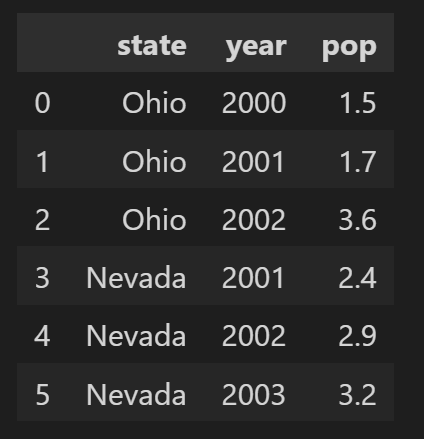
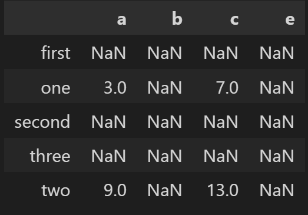

# 暑期 AI 实践营总结

## 二、Pandas 入门

### 1. 什么是 Pandas

Pandas 是 Python 语言的一个扩展程序库，用于数据分析，提供高性能、易于使用的数据结构和数据分析工具，基础是 [Numpy](https://www.runoob.com/numpy/numpy-tutorial.html) 为其提供的高性能的矩阵运算。

> Pandas 可以从各种文件格式比如 CSV、JSON、SQL、Microsoft Excel 导入数据。
>
> Pandas 可以对各种数据进行运算操作，比如归并、再成形、选择，还有数据清洗和数据加工特征。
>
> Pandas 广泛应用在学术、金融、统计学等各个数据分析领域。

使用方式

```python
import numpy as np
```

### 2. 文件加载方法

#### 2.1 相关函数

[`read_csv()`](https://pandas.github.net.cn/docs/reference/api/pandas.read_csv.html):  读取 CSV 文件，默认分隔符为逗号，如果文件是用逗号分隔的，则 `read_csv()` 更合适。

```python
df = pd.read_csv('Day2 - train.csv')
```

[`read_table()`](https://pandas.github.net.cn/docs/reference/api/pandas.read_table.html)：读取带分隔符的数据，默认分隔符为制表符，如果文件是用制表符分隔的，则 `read_table()` 更合适。

read_csv 函数和 read_table 有许多有用的参数，例如 sep 分隔符、header 头部行、index_col 索引列等等。

它们的区别只是它们的参数默认值不同，也可以对 sep 分隔符进行定义通过使用一个函数来读取不同分隔符的文件。

> TSV 与 CSV 的区别：
>
> 1. TSV 是用制表符（Tab,'\t'）作为字段值的分隔符，IANA 规定的标准 TSV 格式，字段值之中是不允许出现制表符的。
>
> 2. CSV 是用半角逗号（','）作为字段值的分隔符。

[`read_fwf()`](https://pandas.github.net.cn/docs/reference/api/pandas.read_fwf.html)：读取表格或固定宽度格式的文本行。

当我们有一个`宽度格式化`文本文件时，`read_fwf()` 将非常有用，我们不能使用 `sep`，因为不同的值可能具有不同的分隔符，考虑以下文本文件 `Sample.txt`：

```blank
45 apple  orange banana mango
12 orange kiwi   onion  tomato
```

如果我们看一下 `Sample.txt` ，我们将看到分隔符对于每个值都不相同。所以 `read_fwf()` 将能达到我们正确读取这个文件数据的目的。

代码：

```python
import pandas as pd

df = pd.read_fwf('sample.txt', header=None)
print(df)
```

输出：

```text
    0       1       2       3       4
0  45   apple  orange  banana   mango
1  12  orange    kiwi   onion  tomato
```

#### 2.2 分块读取

逐块读取就是将文本分成若干块，对于几百 MB 的 CSV 文件，可以直接使用 `pd.read_csv()` 进行读取。

然而如果 CSV 文件太大，达到几个 GB ，这种方法就不可取。这时应使用 chunk ，进行分块读取。

```python
chunker = pd.read_csv('Day2 - train.csv' , chunksize = 100) 
print(type(chunker))

for i in chunker:
    print(i)
```

#### 2.3 数据类型

Series 是一个一维的数据类型，其中每一个元素都有一个标签。类似于Numpy中元素带标签的数组。其中，标签可以是数字或者字符串，例如：

```python
sdata = {'Ohio': 35000, 'Texas': 71000, 'Oregon': 16000, 'Utah': 5000}
example_1 = pd.Series(sdata)
example_1 
```

输出：

```text
Ohio      35000
Texas     71000
Oregon    16000
Utah       5000
dtype: int64
```

DataFrame 是一个二维的表结构，Pandas 的 dataframe 可以存储许多种不同的数据类型，并且每一个坐标轴都有自己的标签，你可以把它想象成一个series的字典项，例如：

```python
data = {'state': ['Ohio', 'Ohio', 'Ohio', 'Nevada', 'Nevada', 'Nevada'],
        'year': [2000, 2001, 2002, 2001, 2002, 2003],'pop': [1.5, 1.7, 3.6, 2.4, 2.9, 3.2]}
example_2 = pd.DataFrame(data)
example_2
```

输出：




### 3. 更改表头

> 例：对泰坦尼克号数据表表头更改。 [数据集链接](https://www.kaggle.com/c/titanic/overview)
>
> PassengerId => 乘客ID  					Survived   => 是否幸存  
>
> Pclass    => 乘客等级(1/2/3等舱位)  		Name     => 乘客姓名  
>
> Sex     => 性别         						Age     => 年龄         
>
> SibSp    => 堂兄弟/妹个数  				Parch    => 父母与小孩个数  
>
> Ticket    => 船票信息       					Fare     => 票价         
>
> Cabin    => 客舱         						Embarked   => 登船港口   

`rename()` - 任意的行名 (index) 和列名 (columns) 的修改

```python
# df_new_1 = df.reset_index()
df_new_1 = df_new_1.rename(columns={'PassengerId': '乘客ID'})
print(df_new_1)
```

行名和列名全部修改

```python
df_new_3 = df.reset_index()
df_new_3.columns = ['乘客ID' , '是否幸存' , '乘客等级(1/2/3等舱位)' , '乘客姓名' , '性别' , '年龄' , '堂兄弟/妹个数' , '父母与小孩个数' , '船票信息' , '票价' , '客舱' , '登船港口'] 
print(df_new_3)
```

`add_prefix()`  ，`add_suffix()` - 列名的接头词和结尾词的追加

```python
df_new_2 = df_new_1.add_prefix('事故数据-') #增加接头词，例如：乘客ID => 事故数据-乘客ID
print(df_new_2)
```

`reset_index()` 重置索引

```python
reset_index(level = None, drop = False, inplace=False, col_level= 0, col_fill = '')
```

1. 函数作用：
   重置索引或其 level 。
   重置数据帧的索引，并使用默认索引。如果数据帧具有多重索引，则此方法可以删除一个或多个 level 。

2. 参数：
   drop: 重新设置索引后是否将原索引作为新的一列并入 DataFrame ，默认为 False。
   inplace: 是否在原 DataFrame 上改动，默认为 False。
   level: 如果索引 (index) 有多个列，仅从索引中删除 level 指定的列，默认删除所有列。
   col_level: 如果列名 (columns) 有多个级别，决定被删除的索引将插入哪个级别，默认插入第一级。
   col_fill: 如果列名 (columns) 有多个级别，决定其他级别如何命名。

3. 返回
   DataFrame or None。具有新索引的数据帧，如果 inplace = True ，则无索引。

### 4. 操作数据

例如 df 为加载的 DataFrame：

1. `df.info()` ：查看数据的基本信息。

   ```text
   <class 'pandas.core.frame.DataFrame'>
   Index: 891 entries, 1 to 891
   Data columns (total 11 columns):
    #   Column          Non-Null Count  Dtype  
   ---  ------          --------------  -----  
    0   是否幸存            891 non-null    int64  
    1   乘客等级(1/2/3等舱位)  891 non-null    int64  
    2   乘客姓名            891 non-null    object 
    3   性别              891 non-null    object 
    4   年龄              714 non-null    float64
    5   堂兄弟/妹个数         891 non-null    int64  
    6   父母与小孩个数         891 non-null    int64  
    7   船票信息            891 non-null    object 
    8   票价              891 non-null    float64
    9   客舱              204 non-null    object 
    10  登船港口            889 non-null    object 
   dtypes: float64(2), int64(4), object(5)
   memory usage: 83.5+ KB
   ```

   

2. `df.head(10)`：观察表格前 10 行的数据。

3. `df.tail(15)`：观察表格后 15 行的数据。

4. `df.isnull()`：判断表中数据是否为空，为空的地方返回 True ，其余地方返回 False。

5. `df.columns`：查看DataFrame数据的每列的名称。

6. `df['Cabin']` 或 `df.Cabin`： 查看"Cabin"这列的所有值。

7. `del` 与 `drop` 删除列：

	```python
	# drop 方法
	df_deleted = df.drop(['PassengerId', 'Name', 'Age', 'Ticket'] , axis 	= 1 , inplace = True) # 注意 inplace = True ，改变表格
	df_deleted
	
	# del 方法
	del df['PassengerId']
	```

8. `df.drop()` 隐藏列：

   ```python
   df_drop = df.drop(['PassengerId', 'Name', 'Age', 'Ticket'] , axis = 1) 
   # 注意 inplace = False ，不改变表格
   ```
   

9. `loc` 和 `iloc` 显示数据：

   loc 函数是基于行标签和列标签进行索引的，其基本用法为：`DataFrame.loc[行标签,列标签]`

   iloc 函数是基于行和列的位置进行索引的，索引值从 0 开始，并且得到的结果不包括最后一个位置的值，其基本用法为：`DataFrame.iloc[行位置,列位置]`

   使用 loc 方法将 df 的数据中第100，105，108 行的 "Pclass" ，"Name" 和 "Sex" 的数据显示出来：

   ```python
   df.loc[[100,150,108],['Pclass','Name','Sex']]
   ```

   使用 iloc 方法将 df 的数据中第 100，105，108 行的 "Pclass" ，"Name" 和 "Sex" 的数据显示出来：

   ```python
   dfloc[[100,150,108],[2,3,4]]
   ```

   10. `df.describe()` 输出基本信息，针对特定列可以 `df['Pclass'].describe()`：

       > count : 样本数据大小			mean : 样本数据的平均值
       >
       > std : 样本数据的标准差			min : 样本数据的最小值
       >
       > 25% : 样本数据25%的时候的值	50% : 样本数据50%的时候的值
       >
       > 75% : 样本数据75%的时候的值	max : 样本数据的最大值

   11. 计算两个 DataFrame 相加，例如

       ```python
       frame1_a = pd.DataFrame(np.arange(9.).reshape(3, 3),
                            columns=['a', 'b', 'c'],
                            index=['one', 'two', 'three'])
       frame1_b = pd.DataFrame(np.arange(12.).reshape(4, 3),
                            columns=['a', 'e', 'c'],
                            index=['first', 'one', 'two', 'second'])
       frame1_a + frame1_b
       ```

       

       两个 DataFrame 相加后，会返回一个新的 DataFrame ，对应的行和列的值会相加，没有对应的会变成空值 NaN。

   12. `df.sort_index()`：让行索引升序排序，ascending = False 使其降序。

   13. `df.sort_index(axis = 1)`：让列索引升序排序，ascending = False 使其降序。

   14. `sort_values(by = ['a' , 'c'] , ascending = False )`：让任选两列数据同时降序排序。

   15. 以 "Age" 为条件，将年龄在 10 岁以上和 50 岁以下的乘客信息显示出来。

       ```python
       midage = df[(df['Age'] > 10) & df['Age'] < 50]
       midage.head(3)
       ```

       

### 5. 保存数据

不同的操作系统保存下来可能会有乱码，可以加入`encoding = 'GBK' 或者 encoding = 'utf-8'`

```python
df.to_csv('Day2 - train_chinese.csv',encoding = 'utf-8')
```


